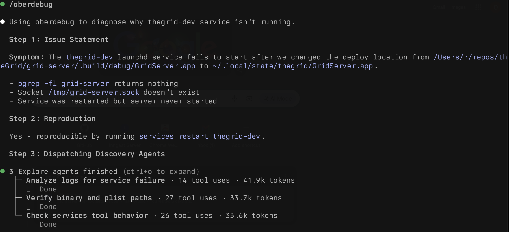
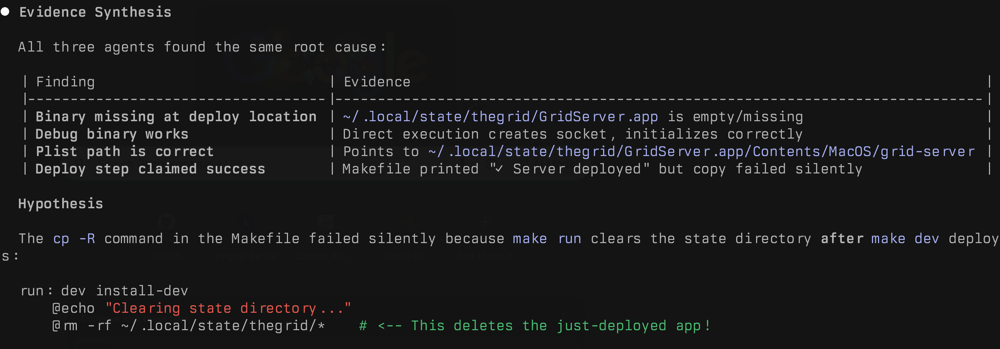
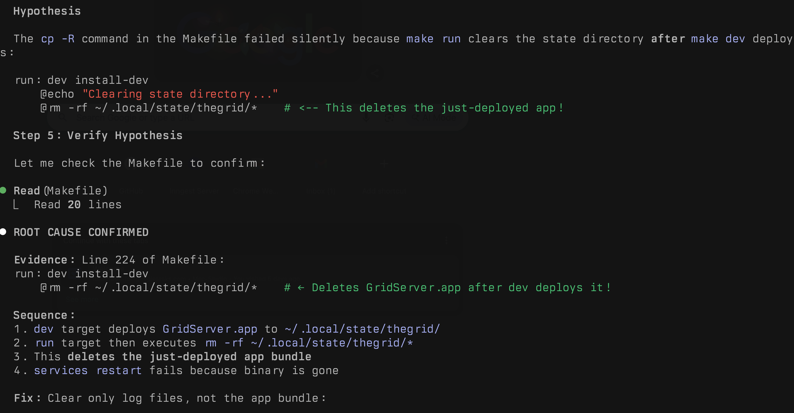

# oberskills

Personal Claude Code skills for enhanced workflows.

## Skills

### oberdebug

Hypothesis-driven debugging with instrumentation loops. Never fix without proof.

**Flow:** Infer issue → Check reproduction → Check logs → Check git → Propose debug logs → User runs → Analyze → Loop until confirmed → Output root cause with evidence

#### Demo

A launchd service wouldn't start after changing deploy paths. oberdebug diagnosed it by dispatching parallel agents to check logs, verify binary paths, and analyze service behavior:







Root cause: The Makefile's `run` target deleted the app bundle right after `dev` deployed it. Found with evidence, not guessing.

## Usage

Add to your Claude Code skills directory:

```bash
# Symlink to Claude skills
ln -s /path/to/oberskills/skills/* ~/.claude/skills/
```

Or copy individual skills as needed.

## License

MIT
