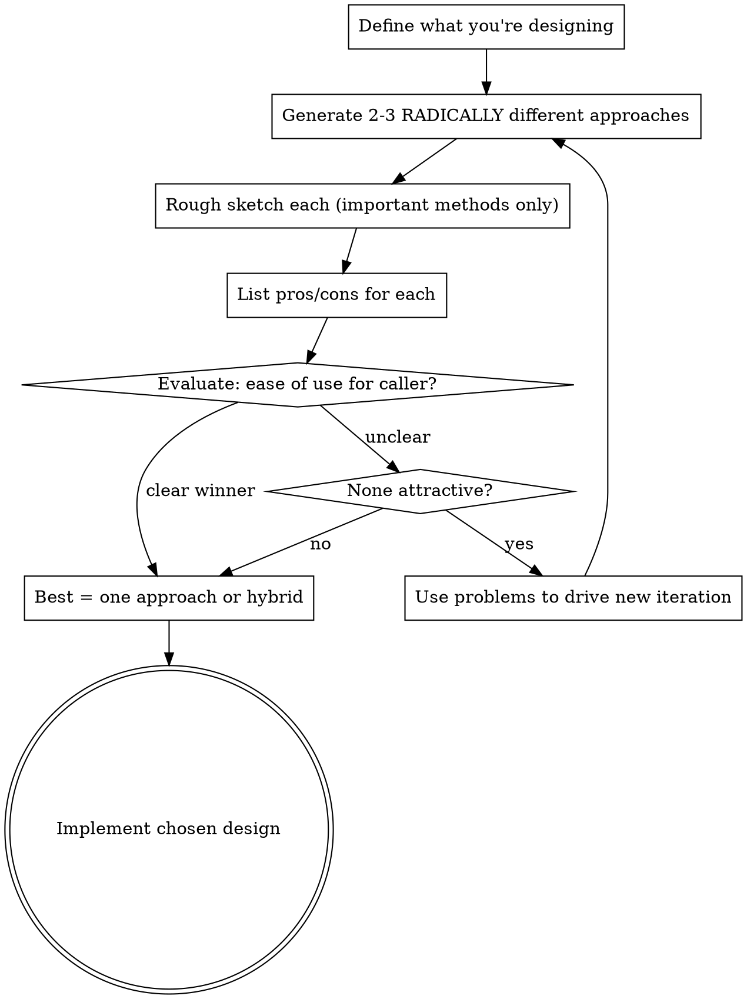

# Design Deep Modules

## Overview

**Core Principle:** Maximize the ratio of functionality to interface complexity. The best modules provide powerful functionality behind simple interfaces.

**Discipline Requirement:** Never implement your first design. Generate 2-3 radically different approaches, compare them, then implement.

## When to Use

- Creating a new class, module, or service
- Designing an API or interface
- Adding a new feature requiring new abstractions
- User says: "design", "create class", "add module", "implement feature", "what's the best interface for..."

## When NOT to Use

- Modifying existing code (see: maintaining-design-quality)
- Reviewing existing design (see: reviewing-module-design)
- Refactoring for simplicity (see: simplifying-complexity)
- Performance optimization (see: optimizing-critical-paths)

---

## Design-It-Twice Workflow



**Time bound:** Smaller modules: 1-2 hours. Larger modules: scale proportionally. This is design time, not implementation time.

---

## Depth Evaluation

| Metric | Deep (Good) | Shallow (Bad) |
|--------|-------------|---------------|
| Interface size | Few methods | Many methods |
| Method reusability | Multiple use cases | Single use case |
| Hidden information | High | Low |
| Caller cognitive load | Low | High |
| Common case | Simple | Complex |

**Exemplar:** Unix file I/O - 5 methods hide hundreds of thousands of lines of implementation.

---

## Three Questions Framework

Ask these when designing interfaces:

| Question | Purpose | Red Flag Answer |
|----------|---------|-----------------|
| "What is the simplest interface that covers all current needs?" | Minimize method count | "I need many methods" |
| "In how many situations will this method be used?" | Detect over-specialization | "Just this one situation" |
| "Is this easy to use for my current needs?" | Guard against over-generalization | "I need lots of wrapper code" |

---

## Information Hiding Checklist

When embedding functionality in a module:

- [ ] Data structures and algorithms stay internal
- [ ] Lower-level details (page sizes, buffer sizes) hidden
- [ ] Higher-level assumptions (most files are small) hidden
- [ ] No knowledge shared across module boundaries unnecessarily
- [ ] Common case requires no knowledge of internal details

---

## Generality Sweet Spot

**Target:** Somewhat general-purpose

| Aspect | Should Be |
|--------|-----------|
| Functionality | Reflects current needs |
| Interface | Supports multiple uses |
| Specialization | Pushed up to callers OR down into variants |

**Push specialization UP:** Top-level code handles specific features; lower layers stay general.

**Push specialization DOWN:** Define general interface, implement with device-specific variants.

---

## Red Flags

| Red Flag | Symptom | Fix |
|----------|---------|-----|
| **Shallow Module** | Interface complexity rivals implementation | Combine with related functionality |
| **Classitis** | Many small classes with little functionality each | Consolidate related classes |
| **Single-Use Method** | Method designed for exactly one caller | Generalize to handle multiple cases |
| **Information Leakage** | Same knowledge in multiple modules | Consolidate in single module |
| **Temporal Decomposition** | Structure mirrors execution order | Structure by knowledge encapsulation |
| **False Abstraction** | Interface hides info caller actually needs | Expose necessary information |
| **Granularity Mismatch** | Caller must do work that belongs in module | Move logic into module |

---

## Anti-Rationalization Table

| Tempting Shortcut | Why It Feels Right | Why It's Wrong |
|-------------------|-------------------|----------------|
| "I'm confident in my first idea" | Experience says it works | Complex problems defeat intuition; alternatives reveal hidden weaknesses |
| "I don't have time for multiple designs" | Deadline pressure | Design time << debugging time for wrong abstraction |
| "The alternatives would be worse" | Quick mental dismissal | Without sketching, you can't actually compare |
| "This is just a simple module" | Scope seems small | Small modules become core dependencies; getting them wrong cascades |
| "I'll refactor later if needed" | Deferred pain | Changing interfaces is expensive; callers multiply |
| "The user already knows what they want" | Seems respectful | They know the PROBLEM, not necessarily the best SOLUTION |
| "This is a standard pattern" | Feels like best practice | "Standard" often means "first thing I saw"; make it explicit |
| "I already know which is best" | Saves time | Then the comparison should be EASY, not skippable |
| "The user is experienced, alternatives would be patronizing" | Sounds respectful and user-centric | Respect means giving best design, not fastest; alternatives validate judgment |

---

## Process Integrity Checks

Before finalizing your design choice, verify:

- [ ] I wrote out alternatives BEFORE evaluating them (not just "thought through" them)
- [ ] My comparison has at least one criterion where my preferred option loses
- [ ] If I chose a hybrid, I stated what I'm sacrificing from each parent approach
- [ ] Someone could reasonably disagree with my choice based on the same comparison

**If user expresses impatience:** Acknowledge it, but complete the process. Say: "I hear the urgency - this comparison takes 2 minutes and helps avoid rework."

---

## Emergency Bypass Criteria

Skip the normal workflow ONLY when ALL of these conditions are true:

1. Production is down RIGHT NOW (not "might break soon")
2. Users are actively impacted, security breach in progress, OR data loss occurring
3. The fix is minimal (rollback or single-line change)
4. You commit to returning for proper implementation within 24 hours

**Emergency does NOT mean:**
- "Demo in 30 minutes" — That's planning failure
- "CEO is asking" — Authority pressure ≠ emergency
- "Team is blocked" — They can wait for you to think
- "We need this fast" — Speed pressure is when discipline matters MOST

**Emergency DOES mean:**
- Production is down and users are impacted NOW
- Security vulnerability being exploited
- Data corruption or loss occurring

---

## Quick Reference

```
BEFORE implementing any module:

1. STOP - Don't code your first idea
2. SKETCH - 2-3 radically different approaches (methods only, no impl)
3. COMPARE - Pros/cons, especially ease of use for callers
4. CHOOSE - Best single approach or hybrid
5. VERIFY - Does it pass depth evaluation?
6. IMPLEMENT - Only then write the code
```

---

*References: [aposd-foundations](../references/aposd-foundations.md) for complexity symptoms*
